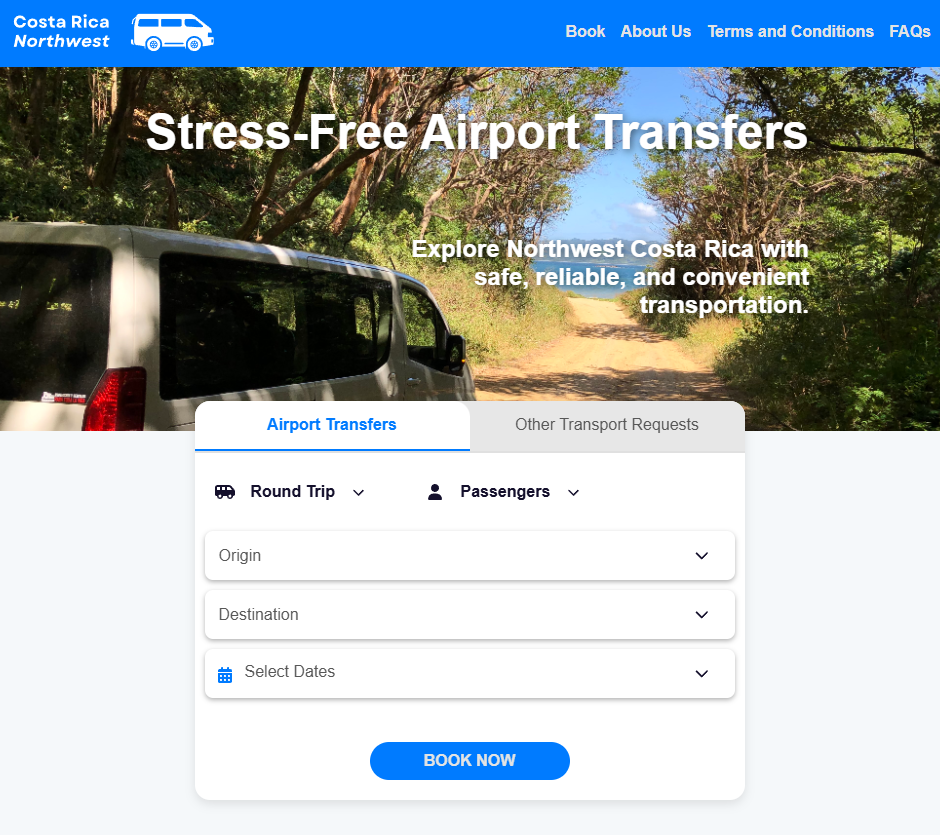
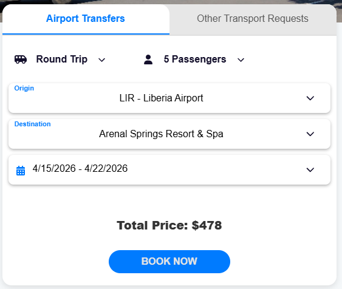
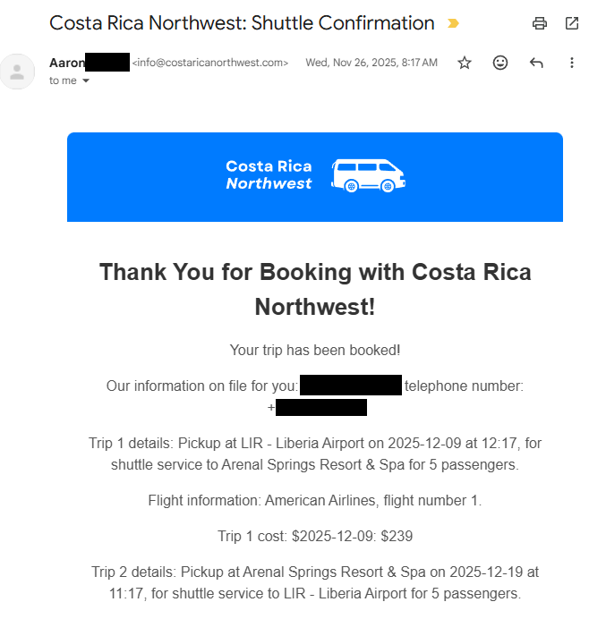

# Costa Rica Northwest

A full-stack web application for **Costa Rica Northwest** — a travel and booking platform *formerly* hosted at [costaricanorthwest.com](https://costaricanorthwest.com/). The owner of the website is getting out of the transportation business, so sold the website to someone else. But was a great learning experience even if it wasn't used much!

Special thanks to Chris Grass and Ed Dorrington for their help with code reviews!

Built with a **React** frontend and a **Python/Flask** backend, deployed on  **AWS EC2** .

## Homepage:



## Booking Form

The booking form connected with SQL database of prices, allowing for real-time pricing information to be shown:



Based on the customer requirement, a Twilio text message confirmation was added to enhance booking security:


Email confirmations were sent out with all required information:



---

## 🛠 Tech Stack

| Layer      | Technology                       |
| ---------- | -------------------------------- |
| Frontend   | React (Create React App)         |
| Backend    | Python, Flask                    |
| Auth       | JWT (flask-jwt-extended), Bcrypt |
| Database   | SQL (PostgreSQL or MySQL)        |
| Deployment | AWS EC2                          |
| Security   | CORS, CSP headers, HSTS          |

---

## 📁 Project Structure

```
Costa-Rica-NW/
├── backend/
│   ├── api/                  # Flask blueprints (locations, prices, bookings, users, etc.)
│   ├── resources/images/     # Uploaded/static images
│   ├── templates/            # Email or HTML templates
│   ├── requirements.txt      # Python dependencies
│   └── server.py             # Flask app entry point
├── frontend/
│   ├── public/               # Static public assets
│   ├── src/                  # React source code
│   ├── package.json          # Node dependencies
│   └── ...                   # Babel, ESLint, Jest config
├── SQL/                      # Database schema and migration scripts
├── .gitignore
└── setup_commands            # Setup reference notes
```

---

## ⚙️ Local Setup

### Prerequisites

* Python 3.x
* Node.js & npm
* A running SQL database (PostgreSQL or MySQL)

### 1. Clone the repo

```bash
git clone https://github.com/kmjohnsen/Costa-Rica-NW.git
cd Costa-Rica-NW
```

### 2. Set up the backend

```bash
cd backend
python -m venv .venv
source .venv/bin/activate       # On Windows: .venv\Scripts\activate
pip install -r requirements.txt
```

Create a `.env` file in the `backend/` directory:

```env
RUNNING_LOCAL=True
JWT_SECRET_KEY=your_secret_key_here
DB_HOST=localhost
DB_NAME=your_database_name
DB_USER=your_db_user
DB_PASSWORD=your_db_password
```

Start the backend:

```bash
python server.py
```

The Flask server runs on [http://localhost:5000](http://localhost:5000/).

### 3. Set up the frontend

```bash
cd ../frontend
npm install
npm start
```

The React app runs on [http://localhost:3000](http://localhost:3000/).

---

## 🚀 API Routes

The backend exposes the following API blueprint groups:

| Blueprint             | Description                          |
| --------------------- | ------------------------------------ |
| `/api/locations`    | Location data                        |
| `/api/prices`       | Pricing information                  |
| `/api/authorize`    | User authentication (login/register) |
| `/api/bookings`     | Trip/tour bookings                   |
| `/api/users`        | User account management              |
| `/api/verification` | Email or identity verification       |

---

## 🔐 Security

* JWT Bearer token authentication
* Bcrypt password hashing
* CORS restricted to allowed origins
* Security headers: `X-Frame-Options`, `HSTS`, `CSP`, `X-Content-Type-Options`

---

## 🗄 Database

SQL schema and setup scripts are located in the `/SQL` directory.

---

## ☁️ Deployment (AWS EC2)

In production, the Flask server serves the compiled React build from `/var/www/html`.

Set `RUNNING_LOCAL=False` in your environment to switch to production mode.
